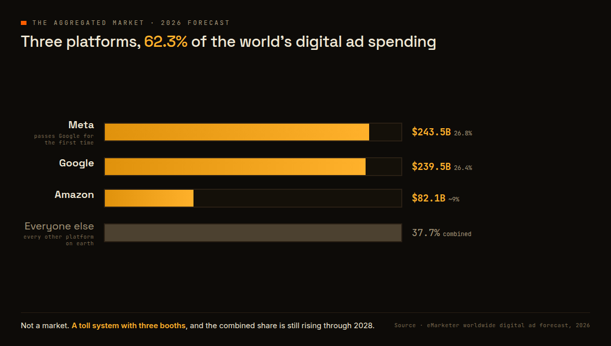
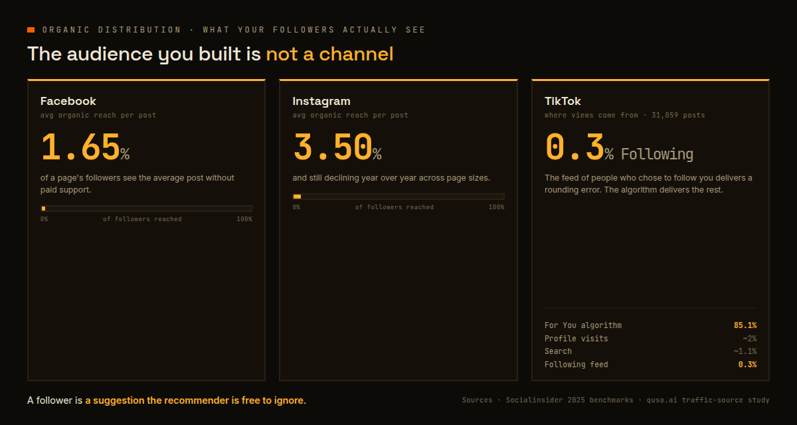
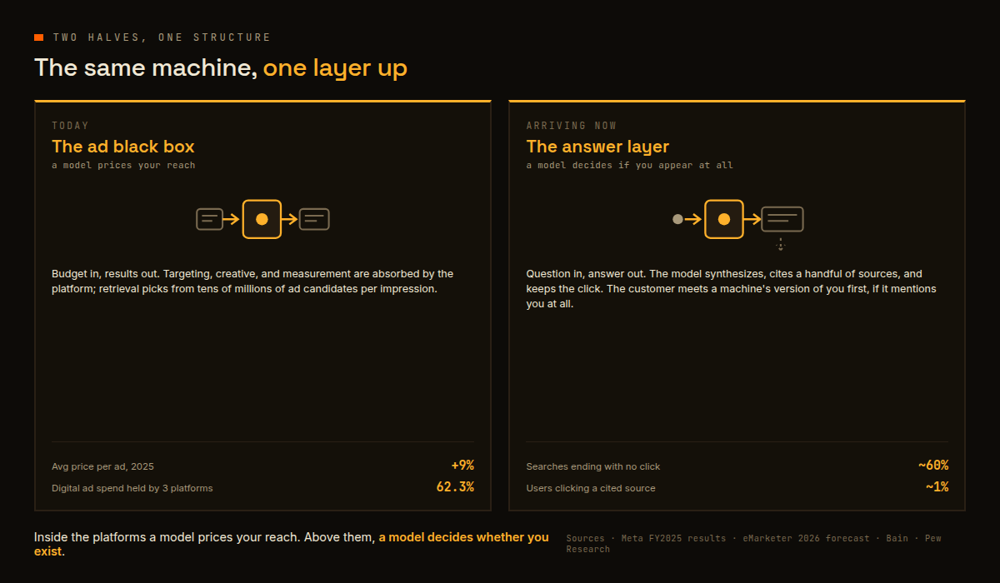

# The Model Decides If You Exist
### Field Guide 002, Aggregated: marketing inside today's platforms, and the answer layer arriving above them

**Header image:** `fg002-cover-1200x627.png`
**Attribution note:** Credits Ben Thompson / Stratechery (Aggregation Theory and the May 2025 Zuckerberg interview), Pew Research Center, Bain & Company, Tinuiti, and the engineering teams at Meta whose own publications document the machine described here.

**SEO title (58 chars):** The Aggregated Market: Field Guide 002 | False Dawn Industries
**SEO description (156 chars):** Three platforms take 62% of digital ad spend, organic reach is a rounding error, and AI answers absorb the click. The response: own your identity and corpus.
**Primary keyword:** aggregated market

---

Start with the number every marketer already feels in their budget: three companies are forecast to take 62.3% of all worldwide digital ad spending in 2026. [eMarketer](https://www.emarketer.com/press-releases/meta-to-surpass-google-in-digital-ad-revenues-for-first-time-ever/) projects Meta at $243.46 billion in ad revenue, passing Google at $239.54 billion for the first time, with Amazon third at roughly $82 billion. That is not a market. That is a toll system with three booths.

This is the second Field Guide in the Growth Cartography series. [The first](https://falsedawn.industries/field-guide) made the general case: when content is free to make and platforms are opaque, the only durable marketing assets are the ones you own and can prove. This one maps the first of the three market structures, the aggregated market, and it comes in two halves. The half you already live in. And the half arriving on top of it.

*eMarketer's 2026 forecast: Meta 26.8%, Google 26.4%, Amazon about 9% of worldwide digital ad spending. Combined, 62.3% and still rising through 2028.*

**The half you live in: rented reach, priced by the landlord.**

Inside the platforms, the free lunch ended years ago and the receipts are public. [Socialinsider's benchmark](https://www.socialinsider.io/blog/social-media-reach/) puts average organic reach for a Facebook page post at about 1.65% of followers. Instagram sits near 3.50%. On TikTok, the decoupling is total: [across 31,059 posts with traffic-source data](https://quso.ai/research/how-the-tiktok-algorithm-works), 85.1% of views arrived through the algorithmic For You page and roughly 0.3% came from the feed of people who actually chose to follow the account. Read that again. The audience you spent a decade building is not a channel. It is a suggestion the recommender is free to ignore.

*Organic reach per post as a share of followers: Facebook 1.65%, Instagram 3.50%. On TikTok, the Following feed delivers about 0.3% of views while the For You algorithm delivers 85.1%.*

So you pay. And the price of paying is set unilaterally, quarter by quarter. [Meta's own full-year 2025 results](https://www.prnewswire.com/news-releases/meta-reports-fourth-quarter-and-full-year-2025-results-302673127.html) report the average price per ad up 9% while impressions grew 12%; the platform raises the toll even as it manufactures more road. The honest nuance, visible in [Tinuiti's Q3 2025 benchmark](https://tinuiti.com/research-insights/research/digital-ads-benchmark-report-q3-2025/) of roughly $4 billion in managed media, is that prices do not only go up: Facebook CPMs fell 6% as Reels flooded the auction with inventory, Google search CPCs dipped 1% when Amazon stepped out of shopping auctions, TikTok CPMs dropped 22% under regulatory uncertainty. But notice what moved those prices. A rival leaving an auction. A platform diluting its own inventory. A geopolitical standoff. Everything except you. Price, volume, and placement are all levers, and none of them are in your hands.

The platforms are not hiding where this goes. [Meta's engineering blog describes Andromeda](https://engineering.fb.com/2024/12/02/production-engineering/meta-andromeda-advantage-automation-next-gen-personalized-ads-retrieval-engine/), the retrieval engine behind its Advantage+ automation, selecting from tens of millions of ad candidates for every impression opportunity. And Mark Zuckerberg, in [his May 2025 interview with Stratechery's Ben Thompson](https://stratechery.com/2025/an-interview-with-meta-ceo-mark-zuckerberg-about-ai-and-the-evolution-of-social-media/), described the end state in one sentence: "you're a business, you come to us, you tell us what your objective is, you connect to your bank account, you don't need any creative, you don't need any targeting demographic, you don't need any measurement, except to be able to read the results that we spit out." Targeting, creative, measurement. The three jobs marketing departments were built around, absorbed into the machine, with a bank account as the only remaining interface.

**The half arriving now: the answer layer.**

Here is the pivot this guide exists to make. That machine is not staying inside the ad platforms. The same structure, a model deciding who gets seen, is now being installed one layer higher, at discovery itself, before a single dollar is spent.

Discovery is moving behind recommenders and chat assistants. [Pew Research](https://www.pewresearch.org/short-reads/2025/07/22/google-users-are-less-likely-to-click-on-links-when-an-ai-summary-appears-in-the-results/), watching the real browsing behavior of 900 U.S. adults across 68,879 Google searches, found that 58% hit an AI-generated summary in a single month, that people click less when a summary appears, and that only about 1% clicked a source cited inside the summary. [Bain](https://www.bain.com/insights/goodbye-clicks-hello-ai-zero-click-search-redefines-marketing/) found roughly 80% of search users now lean on AI summaries for at least 40% of their searches, that about 60% of searches end with no click to any website, and estimates the shift is cutting organic web traffic by 15% to 25%. The click you used to buy, or earn, is increasingly absorbed at the answer.

The wreckage is measurable and the disintermediation is already in court. [Chartbeat data published by the Reuters Institute](https://pressgazette.co.uk/media-audience-and-business-data/google-traffic-down-2025-trends-report-2026/) shows global publisher traffic from Google down roughly a third in the year to November 2025. [Chegg sued Google](https://www.cnbc.com/2025/02/24/chegg-sues-google-for-hurting-traffic-as-it-considers-alternatives.html). [Penske Media, publisher of Rolling Stone and Variety, sued too](https://techcrunch.com/2025/09/14/rolling-stone-owner-penske-media-sues-google-over-ai-summaries/), alleging a coercive bargain: let your content feed the AI summaries or take worse rankings. This is [Ben Thompson's Aggregation Theory](https://stratechery.com/2015/aggregation-theory/) playing out one layer up: the aggregator owns demand, absorbs the relationship, and reduces every supplier to an interchangeable input.

*Inside the platforms, a model prices your reach. Above them, a model now decides whether you appear at all. Pew: about 1% click a cited source. Bain: about 60% of searches end without a click.*

**What the model rewards, and what it cannot rent to you.**

If a model now stands between you and your customer, the strategic question becomes: what makes a brand retrievable, citable, and recommended? The early evidence is uncomfortable and useful. Most brand mentions in AI answers, [roughly 85% by AirOps's count](https://www.airops.com/report/the-2026-state-of-ai-search), originate from third-party pages, not your own domain. Citation share is concentrated and volatile week to week. And models carry a documented incumbency bias: [in controlled tests, when competing products had identical specs, the well-known brand was recommended every single time](https://arxiv.org/abs/2606.17443). The answer layer favors established, heavily attested, verifiable identities.

Which means the two assets that survive both halves of the aggregated market are the same two assets. A persistent identity, coherent and referenced widely enough that the model treats it as real. And an owned corpus of trustworthy, machine-retrievable answers, structured so any engine can ground its response in your verified facts rather than a stranger's summary of you. Retrieval-augmented generation makes this mechanical: a model that can query your corpus at answer time cites your ground truth instead of guessing. That is not a nicety. In a market where the recommender decides existence, it is the only input still connected to your hands.

This is what the Pile build demonstrates in working code: a private folder turned into a structured, verifiable, citable corpus, with provable honesty in the delivery. Not because the folder is magic, but because in an aggregated market, being the most retrievable, most verifiable node in the web of signals about you is the whole game. Own the ground truth, then earn the off-site validation that makes models trust it.

**The map, honestly drawn.**

Do not overcorrect. Search is not dead; adoption is uneven, AI referral traffic is still tiny in absolute terms, and the platforms will keep printing performance for years. The thesis is narrower and harder: discovery is being intermediated, the intermediary does not hand back the relationship, and every structural trend, spend concentration, reach collapse, automation, answer absorption, points the same direction. You cannot own the model. You cannot own the auction. You can own who you are and what you know, in a form machines can verify.

Every quarter spent renting commoditized reach is a quarter not spent building the identity and the corpus that survive the aggregator. The window closes the moment a competitor's system becomes the answer your customer's model reaches for first.

The machine is already deciding. Give it something of yours to find.

Both are live now: [Field Guide 003: Decentralized](https://falsedawn.industries/field-guide-003), on owned knowledge graphs, and [Field Guide 004: Autonomous](https://falsedawn.industries/field-guide-004), on marketing systems agents can safely call. Pressure-test the thinking against real, working code at [github.com/jratlee/FDI](https://github.com/jratlee/FDI).
