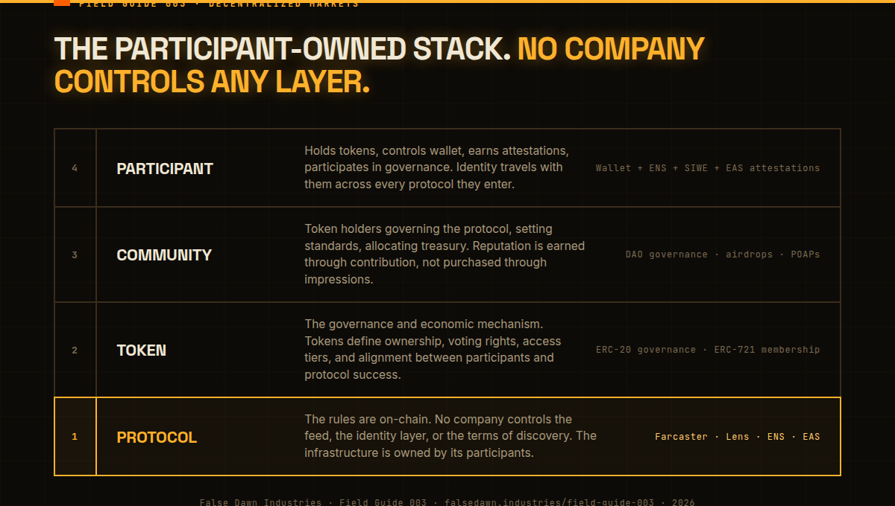
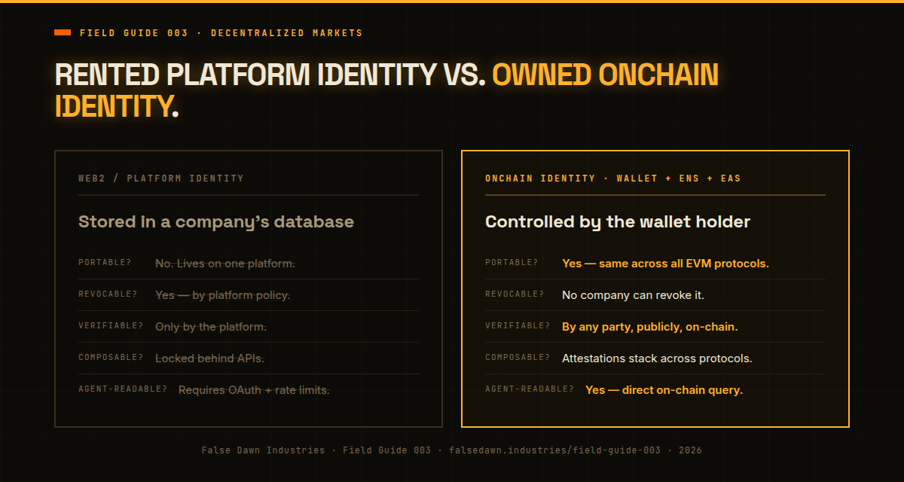
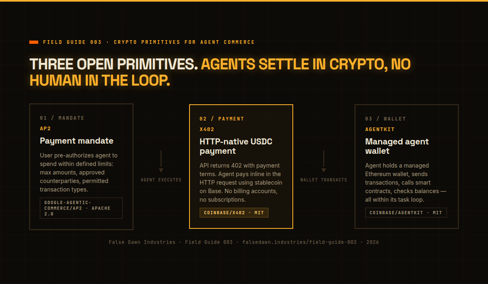

# The Network Is the Product
### Field Guide 003, Decentralized: marketing within crypto-powered networks where the participants own the rails

**Header image:** `fg003-cover-1200x627.png`
**Attribution note:** Credits the Farcaster protocol team, Lens Protocol, the Ethereum Foundation (EIP-4361 / SIWE), Coinbase (x402, AgentKit), and the Google Agentic Commerce working group (AP2). All build references are to MIT-licensed, actively maintained open-source repositories verified against GitHub as of July 2026.

**SEO title (62 chars):** Decentralized Markets: Field Guide 003 | False Dawn Industries
**SEO description (158 chars):** In crypto-powered networks, participants own the rails and there is no feed to buy. The durable asset is a verifiable onchain identity and corpus that travels.
**Primary keyword:** crypto-powered decentralized networks marketing

---

The era of the platform as landlord is not over. But alongside it, a parallel infrastructure has been built — one where the tenants own the building.

Crypto-powered networks are structurally unlike every market that came before them. The database is public. The identity layer is in a wallet, not in a platform's user table. The governance is encoded in tokens, not in a company's terms of service. Discovery is distributed across open protocols and community-curated channels, not concentrated in a single feed that one company can reprice overnight. There is no landlord to petition for better placement. There is no advertising product to buy. And that changes marketing in a way that most playbooks have not caught up to.

This is the third guide in the FDI Growth Cartography series. The first made the general case: when content is free to make and platforms are opaque, the only durable marketing assets are the ones you own and can prove. The second mapped the aggregated market — platforms and the AI answer layer arriving above them — and argued that the winning move is to own a persistent identity and a corpus that models can retrieve, verify, and cite. This guide maps the decentralized market: the crypto-powered networks where the participants have already moved into the building, and they own it.

*Protocol → token → community → participant. Each layer is participant-owned and governed. There is no company in the stack with the power to change the rules unilaterally.*

**There is no feed to win. That is the point.**

On Farcaster — the decentralized social protocol that runs its content on a peer-to-peer Hub network rather than a company's servers — a brand cannot buy premium placement in the main feed. There is no main feed, controlled by one company, with a sponsored-post product attached. There are clients (Warpcast, Supercast, and others), channels (topic-specific communities within the protocol), and recommendation surfaces built by independent teams on top of the open protocol. The closest analogy in the brand's existing toolkit is something between earned media and community management, except that every interaction is onchain and every participant's reputation is publicly inspectable.

On Lens — the social graph stored as smart contracts on EVM chains — posts and follows are blockchain transactions. A brand's Lens presence is, technically, the brand's own property in a way that a Facebook page never was: the content lives in smart contracts the brand interacts with directly, not in a database the platform controls. Lens Open Actions let community members mint tokens, claim POAPs, or make purchases directly from a post, with the wallet address and transaction recorded onchain.

This is the decentralized market's core structural fact: participation and contribution are the distribution mechanisms, and both are partially legible onchain. A wallet that has been contributing to a protocol's governance for six months, has cast regularly into relevant channels, holds the community's token, and has earned attestations from respected community members — that wallet has a reputation. It is publicly auditable. It travels. And it cannot be taken away by a policy change.

Ethereum Name Service registered millions of human-readable `.eth` names across its first several years of operation, making `brand.eth` a portable identity that resolves the same way in every ENS-compatible wallet and application. Sign-In with Ethereum (EIP-4361) — a formal Ethereum standard, implemented cleanly in the `wevm/viem` library (MIT, actively maintained) — lets any application verify that a user actually controls the wallet they claim, without storing a password or trusting a third-party OAuth provider. Together, ENS and SIWE are the naming and authentication layer of an identity stack that no platform owns.

*A web2 identity lives in a company's database and travels nowhere. An onchain identity (wallet + ENS + attestations) is the same across every EVM-compatible protocol and cannot be unilaterally revoked.*

**Frames, tokens, and the mechanics of reach in a participant-owned network.**

Farcaster Frames are the format innovation worth watching carefully. A Frame is an interactive mini-app embedded in a cast — a product card, a mint button, a gate, a quiz. The user's interaction is a wallet signature: a cryptographically verified, onchain action with the user's wallet address attached. From a marketing standpoint, Frames are the first social format that produces first-party data by design. The "click" is a wallet transaction. There is no cookie, no pixel, no post-click attribution to reconstruct. The interaction happened onchain and it is permanent.

`neynarxyz/nodejs-sdk` (MIT, active, GitHub) provides a production API for Farcaster: publishing casts, managing channels, validating Frame interactions. `lens-protocol/lens-sdk` (MIT, active, GitHub) does the same for Lens. Both are live SDKs with documented APIs, not whitepapers. The "how you actually build here" has a concrete answer, which is a meaningful threshold for any new channel to clear.

Token-gating is the community segmentation mechanism. Once a wallet's identity is verified via SIWE, checking token balances against any ERC-20 or ERC-721 contract is a single API call. A brand can create tiered access — early supporters, governance participants, power users — that is encoded in smart contracts rather than in a CRM segment that might be erased in a data migration. The tier credential is in the user's wallet, portable, and transferable if the user chooses.

Airdrops are the acquisition mechanic. Distributing tokens to wallets that meet specific criteria — early users, active contributors, holders of a related asset — is how crypto protocols form communities of owners. A thoughtful airdrop design is, at its core, a definition of the brand's ideal community member encoded in smart contract eligibility criteria. The wallets that qualify receive an economic stake in the brand's success. That is a different relationship than a follower who was reached by a paid impression.

POAPs (Proof of Attendance Protocol) issue onchain tokens as attendance records for events, AMAs, and community milestones. A wallet's POAP collection is a public, independently verifiable track record of participation. For a brand running events and community programs, POAPs are the mechanism for creating a permanent record in the attendee's wallet — one that can be referenced in future interactions without asking the attendee to prove anything again. The Ethereum Attestation Service (EAS) generalizes this: any party can issue a signed, publicly-verifiable claim about any wallet address, composable with every other attestation in the ecosystem.

The strategic picture that emerges from these primitives: reach in a crypto community is earned through genuine participation and verifiable contribution. It is measured differently than impressions. And it compounds differently than a follower count that decays toward zero when the algorithm stops favoring you.

**The honest limit of this market.**

This guide is not an argument that every brand needs a DAO or a token. The crypto ecosystem's user base remains heavily concentrated among early adopters, technically sophisticated participants, and DeFi power users. Governance attacks, rug pulls, and sybil-farming are documented failure modes that a brand entering this space needs to understand. The case for paying attention is not that the market is already large — it is that the market is building infrastructure that will matter more broadly as agent commerce scales.

Which brings us to the part of this guide that has the most direct bearing on the next ten years.

**The agent commerce layer: x402, AP2, and AgentKit.**

Agents are going to transact with agents. The question is: what settlement layer will they use?

The answer taking shape in the open-source ecosystem is crypto. Not because it is ideologically preferred, but because it is technically the cleanest solution to the agent commerce problem: an agent that can hold a wallet, check a balance, and send a USDC payment inline in an HTTP request does not need a billing relationship, a credit card on file, or a human to approve the transaction. It just pays.

`coinbase/x402` (MIT, active) implements the HTTP 402 "Payment Required" status code as a practical payment protocol. An x402-enabled API server returns a `402` response with payment terms when an unauthenticated request arrives. The agent pays in USDC on Base or another EVM chain, attaches the payment receipt to the request header, and retries. The entire flow is HTTP-native. No billing accounts. No subscriptions. No human in the loop.

`coinbase/agentkit` (MIT, active) gives an AI agent a managed Ethereum wallet with transaction capabilities: send tokens, call smart contracts, check balances, interact with DeFi protocols. For a brand building an agent-native product, AgentKit is the foundation for an agent that participates in token-gated communities, pays for API access, or claims POAPs on behalf of users, all within its task loop.

The `google-agentic-commerce/AP2` specification (Apache 2.0, public proposal, 2026) describes a payment mandate: a pre-authorization a user grants to an agent, specifying the conditions under which the agent may spend on their behalf — maximum amounts, approved counterparties, permitted transaction types. AP2 mandates are composable with both web2 payment rails and onchain settlement. For a brand that wants to be a trusted, agent-reachable destination, publishing an AP2-compatible specification for what your services accept and what they cost is the onchain equivalent of publishing a price list.

Put the three together: a user pre-authorizes an agent with a payment mandate (AP2). The agent discovers a service, receives a `402` response with payment terms (x402). The agent pays using a managed wallet (AgentKit). The transaction is onchain and auditable by all parties. The brand is paid in stablecoins, in real time, by a machine acting on behalf of a human, with no intermediary.

For this to work, the brand needs: an API that speaks x402, an onchain identity the agent can verify, and a corpus of trustworthy claims about what the brand offers and what it costs. The FDI owned-system thesis — "a persistent identity and corpus you can prove" — is the direct answer to what a brand needs to be agent-discoverable in a crypto-native commerce context.

*The three primitives that make agent-to-agent commerce in crypto work: a managed wallet (AgentKit), HTTP-native payment (x402), and a pre-authorized spending mandate (AP2). All three are MIT-licensed and in active development.*

**What you own in the decentralized market.**

The owned-system thesis lands differently in crypto than in the aggregated market, and more concretely. In the aggregated market, "owning your identity" is partly a content strategy and a bet on how models will weight signals. In a crypto network, owning your identity is a technical fact: your wallet controls your ENS name, your attestations, your governance votes, your token holdings. It is verifiable by any protocol that wants to check it. No platform migration can erase it.

The brand that builds on this stack — that establishes a credible `brand.eth`, earns attestations through genuine community participation, maintains a Farcaster presence in the channels where its community lives, and publishes an x402-accessible API with a clean corpus behind it — owns an asset that compounds over time, travels across protocols, and is accessible by agents without a human in the loop.

The alternative is what most marketing playbooks currently offer for crypto: buy a few sponsored posts from crypto influencers, run a points program, and hope for a price pump. The track record of that approach is documented and not encouraging.

The window to build owned onchain identity is now, while the communities are relatively small and the standards (SIWE, EAS, x402, AP2) are still new enough that a brand that ships something real stands out. The window closes the moment the protocols mature enough that showing up is the expectation, not the differentiator.

Next in the series: Autonomous markets — agent-to-agent marketplaces, the growth-curve dynamics, and what it means to market to machines at scale. Follow False Dawn Industries to get it the day it drops, and pressure-test the thinking against working code at github.com/jratlee/FDI.
