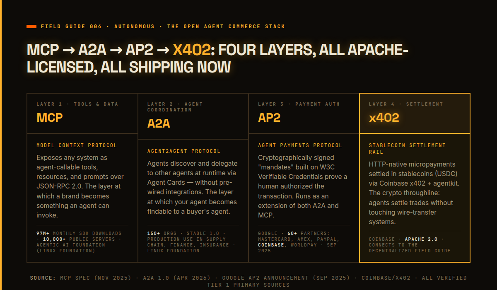

# When the Buyer Is Software
### Field Guide 004, Autonomous: agent-to-agent market dynamics, the growth curve, and what it means to market to machines

**Header image:** `fg004-cover-1200x627.png`
**Attribution note:** Credits Stripe / OpenAI (ACP), Google (AP2, A2A), the Linux Foundation (Agentic AI Foundation, A2A Protocol Project), Anthropic (MCP), Morgan Stanley, McKinsey QuantumBlack, Adobe, OWASP, Google DeepMind / ETH Zurich (CaMeL), and Simon Willison (the lethal trifecta).

**SEO title (61 chars):** Autonomous Markets: Field Guide 004 | False Dawn Industries
**SEO description (158 chars):** Agents are already buying at scale, the protocols are open, and the growth curve points toward Meta-sized agent marketplaces. The response: become a callable interface.
**Primary keyword:** autonomous market

---

The most important marketing fact of 2026 is not an ad statistic. It is this: roughly 23 percent of Americans made a purchase using AI in the month before December 2025, according to Morgan Stanley — and that figure will look small in five years. McKinsey puts the global opportunity at $3 trillion to $5 trillion in orchestrated commerce by 2030. Adobe, measuring more than a trillion visits to US retail sites, found AI-referred traffic up 393 percent year over year in Q1 2026.

This is the fourth Field Guide in the Growth Cartography series. The first made the general case: when content is free to make and platforms are opaque, the only durable marketing assets are the ones you own and can prove. The second mapped the aggregated market — three platforms pricing your reach. The third introduced the FDCP role for operating AI agent fleets. This one maps the market those fleets are building: agents transacting with agents, the protocol stack that makes it possible, the growth curve as those marketplaces scale, and the throughline that runs from your marketing system all the way to stablecoin settlement.

*The open stack shipping now: MCP exposes tools and data, A2A lets agents find and delegate to each other, AP2 handles payment authorization and intent verification, and x402 settles in stablecoins. Four layers, all Apache-licensed, all foundation-governed.*

## The market is already here

The signal that autonomous commerce crossed from prediction to production arrived in two weeks in September 2025. On September 16, Google announced the Agent Payments Protocol (AP2), an open commerce standard co-developed with more than sixty organizations including Mastercard, American Express, PayPal, Coinbase, Adyen, and Worldpay. Two weeks later, on September 29, Stripe and OpenAI published the Agentic Commerce Protocol (ACP) under Apache 2.0 and switched on Instant Checkout inside ChatGPT for over 700 million weekly users — with Etsy sellers live and Shopify's one-million-plus merchants rolling in. The pace was not a coincidence: two rival protocol stacks, two weeks apart, both open-source, both backed by the incumbents of payments and commerce. That is not a startup bet. That is the existing financial system standardizing agent checkout now.

The demand behind the protocols is measured. Adobe's Q1 2026 retail data shows AI-referred visits converting to purchase better than non-AI channels, and 39 percent of consumers saying they had used AI to shop with 85 percent reporting it improved the experience. Among the forecasts, Morgan Stanley scopes the US e-commerce opportunity at $190 billion to $385 billion by 2030, capturing 10 to 20 percent of market share, with groceries and CPG as the largest growth driver. McKinsey scopes global orchestrated goods revenue at $3 trillion to $5 trillion. Bain adds a US retail-only forecast pointing the same direction. The ranges differ by scope and method; every independent source points the same direction and near-term.

The structural break is Google's own diagnosis: "today's payment systems generally assume a human is directly clicking 'buy' on a trusted surface," and autonomous agents "break this fundamental assumption." That sentence appeared in Google's AP2 announcement. When the engineering team at the world's largest payments-adjacent company frames its own protocol as a fix for a broken assumption, the assumption is broken.

## The protocol stack

Four open standards now layer into an end-to-end agent commerce stack. Understanding them is the prerequisite for understanding the growth curve.

**MCP — the callable-tool surface.** Anthropic open-sourced the Model Context Protocol in November 2024 and donated it to the Linux Foundation's Agentic AI Foundation on December 9, 2025 — co-founded with Block and OpenAI, with platinum members including AWS, Bloomberg, Cloudflare, Google, and Microsoft. MCP has since passed 97 million monthly SDK downloads and 10,000 active public servers, with client support across ChatGPT, Gemini, Microsoft Copilot, Cursor, and VS Code. Its three primitives — Resources (context), Prompts (workflows), and Tools (callable functions) — are how any system makes itself queryable by an agent. This is the layer at which a brand becomes something an agent can invoke.

**A2A — agent-to-agent coordination.** Google announced the Agent2Agent Protocol at Cloud Next in April 2025 with more than fifty founding partners; by its one-year mark in April 2026, the Linux Foundation A2A Protocol Project reported more than 150 supporting organizations, deep integration across Google, Microsoft, and AWS, and production use across supply chain, financial services, insurance, and IT operations. A2A's mechanic is dynamic discovery through "Agent Cards" — a runtime way for one agent to find another agent's identity, capabilities, and endpoints without being wired together in advance. This is how a customer's shopping agent finds your order-fulfillment agent without a directory or an integration engineer.

**AP2 — payment authorization.** Google's Agent Payments Protocol is explicitly designed to run as an extension of both A2A and MCP. Its distinguishing feature is cryptographically signed "mandates" built on the W3C Verifiable Credentials standard — a way for an agent to prove that a real user authorized a specific transaction, rather than acting autonomously beyond its delegated scope. AP2 answers the question that every brand will eventually ask: how do I know this agent has permission to buy?

**x402 and stablecoin settlement.** The layer below AP2 is the payment rail, and the open stack is already pointing at crypto. Coinbase's x402 protocol enables HTTP-native micropayments settled in stablecoins, and Coinbase's agentkit gives agents a wallet. AP2's co-developer list includes Coinbase. The A2A founding partner list includes Coinbase. This is not a coincidence or a side bet: the open agent commerce stack is being built with stablecoin settlement as a first-class rail, not a future option. The same agents that call your MCP server and authorize a purchase through AP2 can settle that purchase in USDC without touching a wire-transfer system. The implications for cross-border commerce, micropayment pricing, and B2B settlement between agent fleets are non-trivial. The Decentralized Field Guide will follow this thread into crypto-native networks; the Autonomous guide plants the flag here.

## The growth curve

The question that matters more than the protocols is the curve: what does this market look like as agent marketplaces scale? The Meta and Google comparison in this series is not hyperbole. It is the structural template.

When Meta and Google became the dominant aggregators, they did three things to the market: they intermediated demand (your customer now discovers through them), they priced the access (you pay to reach who you could once reach for free), and they created compounding moats (more data → better models → more users → more data). Now trace the same pattern through agent marketplaces.

Demand intermediation is already in motion. Adobe's finding that "major portions of US retail websites are not entirely readable by machines" is not a technical complaint; it is the early signal of a bifurcated market, where machine-legible brands get retrieved and cited, and brands that are not machine-legible cease to exist in agent-mediated discovery. This is the aggregated market's organic-reach collapse happening again, one layer up, faster, because agents operate at machine speed with no human slowdown in the loop.

Selection, pricing, and reputation all run at machine speed in an agent marketplace. A shopping agent evaluating a thousand product options in a single query does not read landing pages; it calls APIs, checks schema, validates provenance, and moves on. The brands that win early accumulate citation signals and reputation scores that compound the way follower counts once compounded on platforms — except the accumulation happens orders of magnitude faster because the evaluation loop has no human latency. Small early advantages become large structural advantages before a human CMO has time to notice the curve has turned.

The crypto-settlement layer accelerates this further. When agents settle trades in stablecoins, the friction of cross-border and cross-platform transactions drops to near zero. A brand that is callable and payable in one protocol step can participate in agent marketplaces that span jurisdictions and currencies without building payment rails for each one. The brands that are not callable and payable simply will not appear as an option in the agent's decision tree.

The window to build position before these marketplaces mature is the strategic variable the guide exists to name. The compounding dynamics of agent marketplaces mean that the cost of being early is low and the cost of being late is high — the same math that applied to SEO in 2005, to the app store in 2008, and to platform social in 2012. The difference is speed: the organic-reach collapse on Facebook took years; agent-marketplace selection dynamics will play out in quarters.

## The trust boundary is the product

The commerce argument requires a security argument. Not as a caveat — as its enabling condition.

OWASP ranks prompt injection as the number one risk to LLM applications, defining it as occurring when retrieved content carries hidden instructions that alter the model's behavior. OWASP calls the specific failure mode relevant here "indirect prompt injection": when an agent retrieves external content — a product page, a document, a database entry — that content can instruct the agent to do something the user never intended. The field's leading application-security body named this the number-one risk, then published a dedicated Top 10 for Agentic Applications in December 2025, reviewed by NIST, the European Commission, and the Alan Turing Institute.

The reason this is an architecture problem rather than a tuning problem is well-established. Simon Willison, who coined the term "prompt injection," describes the "lethal trifecta": an agent becomes exploitable the moment it combines access to private data, exposure to untrusted content, and the ability to communicate externally — because models cannot reliably distinguish trusted instructions from untrusted retrieved content. Google DeepMind and ETH Zurich's CaMeL paper (March 2025) puts the fix at the systems level: separate the control flow (what the agent is trying to do) from the data (what it retrieves) at the architecture level, rather than asking the model to self-distinguish. "Never let data become a command" is the one-sentence version of the CaMeL insight.

This stopped being theoretical in November 2025, when Anthropic disclosed the first documented large-scale cyberattack executed largely by an AI agent: a state-sponsored group manipulated the Claude Code tool into attempting infiltration across roughly thirty global targets. The blast radius of a successful injection is no longer a bad answer — it is a real action.

The three trust-boundary rules that run through every FDI build:

1. **Treat every retrieved document as hostile input.** Regardless of the source, any content that enters the model's context has had opportunity to be poisoned.
2. **Sanitize everything that goes out.** Outputs that reach other systems or users must be validated against expected structure and content before they leave the agent's control.
3. **Never let data become a command.** Retrieved content is data. Instructions are instructions. Any system where those two streams can mix in the same token context is vulnerable by design.

These three rules are not a defensive appendix to the commerce story. They are what makes an agent-facing marketing system trustworthy enough to be worth calling. AP2's cryptographic mandates are a gate and a proof of intent; MCP's OAuth and host-approval model is a gate on the tool surface; citation-preserving retrieval is what lets an agent trust an answer enough to act on it. The same properties that make a system trustworthy to a human — verifiable, gated, honest — are exactly the properties that make it safely callable by an agent.

## Build the interface, not the ad

The marketing consequence of all five findings — commerce protocols live, interface layer standardizing, agent-to-agent coordination at scale, security as architecture, machine-legibility as a present competitive gap — is a single, specific strategic shift.

In an agent-mediated market, the winning brand asset is not a persuasive page. It is a machine-readable, citable, callable surface. Adobe's measurement of more than a trillion retail visits finds that "major portions of US retail websites are not entirely readable by machines, which limits their visibility across AI search results," and describes AI as "quickly becoming the primary interface between consumers and their favorite brands." The demand is routing through agents. The interfaces (MCP, A2A, ACP, AP2) exist. The brands that have not made themselves legible and callable are being excluded from answers and carts they cannot see.

This is what the FDI builds already demonstrate. Talk to NYC exposes a citable legal knowledge graph through an MCP server, so another agent can query it as a tool while every answer carries its section numbers. Pile puts a gated agent API in front of paid, provably honest answers, so an agent can transact against it with the same integrity a human gets. Skillfoundry's MCP interface makes an owned capability agent-callable by design. Each is an early, working instance of the gated, citable, machine-legible interface the market is now standardizing around.

The protocol stack is Apache-licensed and foundation-governed. Building to MCP, A2A, AP2, and the x402 settlement rail is building on open standards, not betting on one vendor. The crypto-settlement throughline means the investment compounds across both autonomous and decentralized markets — the same callable, verifiable identity that agents can trust in an MCP query is the same identity that travels onchain in a Farcaster community or a token-gated protocol.

The identity you build now — legible to machines, gated, citable, callable, verifiable by agents — is the same identity that will still be yours when the agent marketplaces finish rearranging the landscape. The window to build it closes the moment a competitor's interface becomes the default your customers' agents reach for first.

Every quarter spent buying commoditized reach is a quarter not spent becoming the interface.

Build the interface, not the ad.
