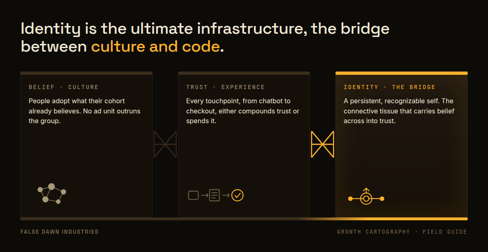
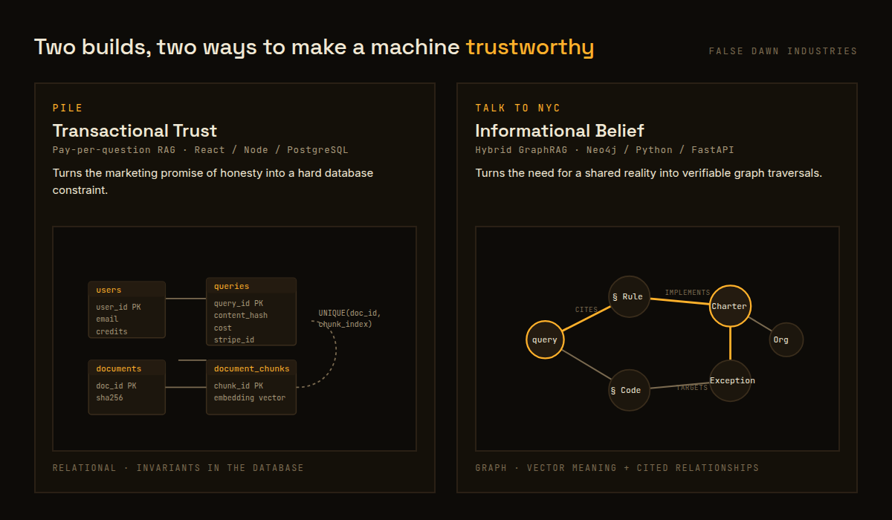
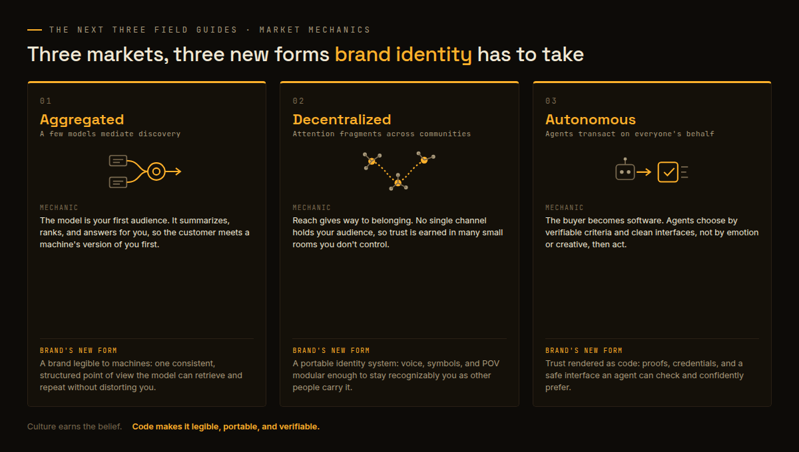

# Build the Machine, Not the Ad
### A CMO's case for owned marketing systems in aggregated, decentralized, and autonomous markets

**Header image:** `li-article-header-1200x627.png`
**Attribution note:** Credits Ben Thompson / Stratechery, Eric Seufert / DeCANT (Mobile Dev Memo), Alice Lassman (Disillusionomics), Yuval Noah Harari (Sapiens), and Dr Karen Nelson-Field / Amplified (the 2.5-second attention-memory threshold), consistent with the launch deck's originality standard.

**SEO title (62 chars):** Owned Marketing Systems for the AI Age | False Dawn Industries
**SEO description (157 chars):** Reach is commoditized and ad platforms are black boxes. The durable play is owned marketing systems: a persistent identity and corpus you can prove. Read on.
**Primary keyword:** owned marketing systems

---

The cost of making content just fell to zero. That's not the opportunity. That's the emergency.

For thirty years, marketing has been a bet on reach: buy attention, count clicks, repeat. That bet is over, and most 2026 budgets haven't noticed yet.

Two ideas from people sharper than me explain why.

The first is Ben Thompson's. In "Content and Community," building on his earlier "AI Unbundling," he traces how every wave of technology removes one bottleneck in the chain from idea to audience: first writing, then the printing press, then the internet. Each time the bottleneck moved, the money moved with it. AI removes the final one, the substantiation of the idea itself. We have reached total content commoditization. A chatbot will now produce any ad, any article, any image, on command.

If content is free to make, then making it is worth nothing. What stays scarce is everything around it: provenance, trust, and the system that decides who sees what.

The second idea is Eric Seufert's. His master's thesis in Applied Computation at Harvard, DeCANT, starts from a hard truth: the ad platforms have collapsed into black boxes. You feed in a budget and a creative, and past that event horizon, light does not escape. You have one or two levers left, and that's it. Seufert's answer is not to surrender and "embrace the void." It's to build your own model, distilled from the platform's own behavior, so you can predict and measure before you spend. Own a system instead of renting an outcome.

Put those two together and you get the thesis I'm building False Dawn Industries on: when reach is commoditized and platforms are opaque, the only durable marketing assets are the ones you own and can prove. A persistent identity. A proprietary corpus. Systems that other machines can query and trust.

Our first Field Guide made the diagnosis. The world will spend $1.3 trillion on advertising in 2026, and per Dr Karen Nelson-Field's attention-memory threshold research, the average digital ad earns about 2.5 seconds of active attention before memory encoding can even begin. Worse, people now price in persuasion the moment they can see it. The economist Alice Lassman calls this Disillusionomics: every tactic a consumer can detect is a tactic they quietly discount. So belief lives in culture, trust lives in experience, and identity is the connective tissue between the two. That framing owes a debt to Yuval Noah Harari's account of how humans have coordinated around shared belief for roughly 70,000 years.

*Belief lives in culture, trust lives in experience, and persistent identity is the span that carries one across to the other.*

That's the map. Here is the terrain I've been building on, because a thesis you can't ship is just a slide.

**Pile** is a pay-per-question answer engine. You ask, you see a free preview, and you pay only if the answer earns it: $0.99 for a quick answer, $1.99 for a deep one. The interesting part isn't the retrieval; underneath it's a fairly standard RAG system running on Postgres with pgvector. The interesting part is that trust has an architecture. The previewed answer and the paid answer are literally the same bytes, generated once and stored, so the preview can never be a bait-and-switch. Every delivery carries a SHA-256 proof-of-delivery hash. If confidence is low, the buyer is warned before they pay, not after. In a Disillusionomics world, provable honesty is the product.

**Talk to NYC** answers plain-English questions about New York City law. It's a Hybrid GraphRAG system: it aggregates thousands of scattered legal XML files into one knowledge graph, then answers using both vector search (for meaning) and graph traversal (for how one rule cites another). Every answer keeps its section numbers attached, so you can check the work. And it exposes that graph through an MCP server, which means other AI agents can query it directly, as a tool inside their own workflows.

*Same goal from two directions: Pile puts honesty in a database constraint, Talk to NYC puts shared reality in a graph you can check.*

Those two builds aren't a portfolio. They're a preview of the three market structures the next Field Guides cover, and why each one is urgent now.

**[Aggregated](https://falsedawn.industries/field-guide-002).** Discovery is moving behind recommenders and chat assistants. More and more, your customer asks a model, not a search box, and the model decides whether you exist. You don't get to negotiate reach with an aggregator. What you can own is a persistent identity and a corpus of trustworthy answers, the way Pile turns a private folder into something a machine can retrieve and cite.

**[Decentralized](https://falsedawn.industries/field-guide-003).** Your knowledge is scattered across documents, product data, support logs, and policies that don't talk to each other. The winners will stitch those fragments into one owned, queryable graph, with the relationships between them preserved and citable, the way Talk to NYC turns a heap of XML into a graph you can actually reason over. Retrieval you own beats targeting you rent.

**[Autonomous](https://falsedawn.industries/field-guide-004).** Agents are about to transact on your customers' behalf, and on yours. That means your marketing system needs to be something another agent can safely call. Talk to NYC's MCP server and Pile's gated agent API are early versions of exactly that, with the trust boundaries that make it survivable: treat every retrieved document as hostile input, sanitize everything that goes out, and never let data become a command.

*Each market rewires how attention and trust flow, and each demands a new form of brand identity: legible to machines, portable across communities, and verifiable by agents.*

Here is the urgency. These three shifts aren't tidy predictions for later this decade. They are happening at once, right now, and they compound. Every quarter you spend buying commoditized reach is a quarter you didn't spend building the identity, the corpus, and the interfaces that will still be yours when the aggregators and the agents finish rearranging the market. The window to build owned marketing systems closes the moment a competitor's system becomes the default your customers' agents reach for first.

You can keep feeding the black box. Or you can build the machine.

All three Field Guides are now live: [Aggregated](https://falsedawn.industries/field-guide-002), [Decentralized](https://falsedawn.industries/field-guide-003), [Autonomous](https://falsedawn.industries/field-guide-004). Follow [False Dawn Industries](https://falsedawn.industries) and pressure-test the thinking against real, working code at [github.com/jratlee/FDI](https://github.com/jratlee/FDI).
