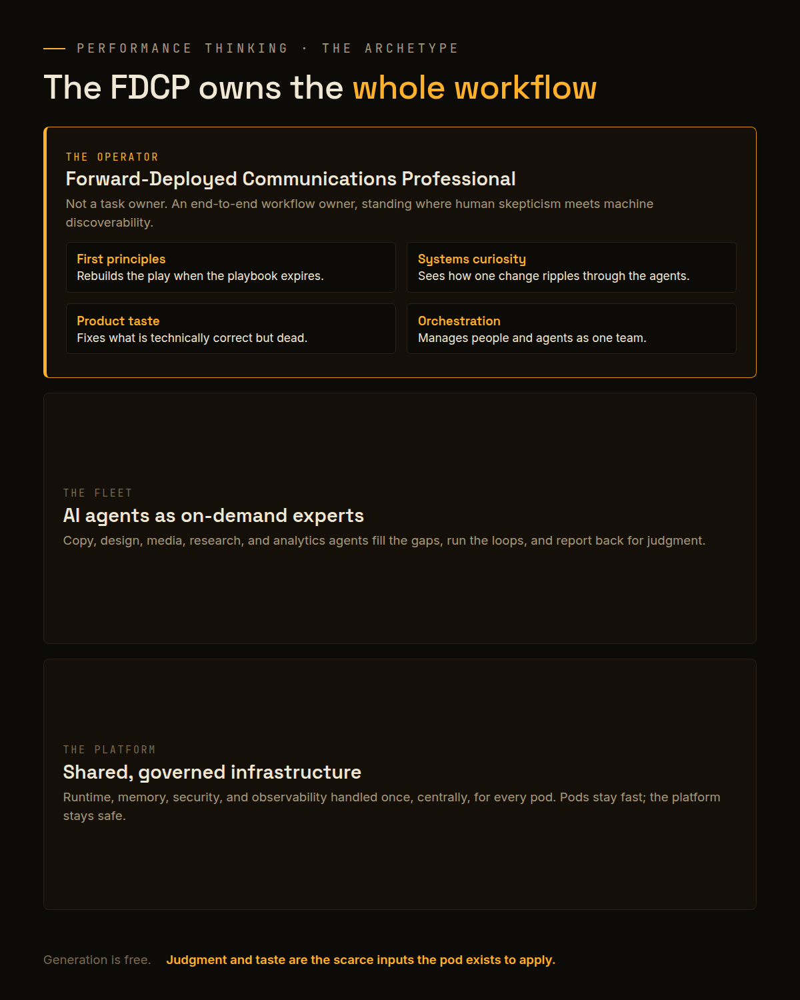
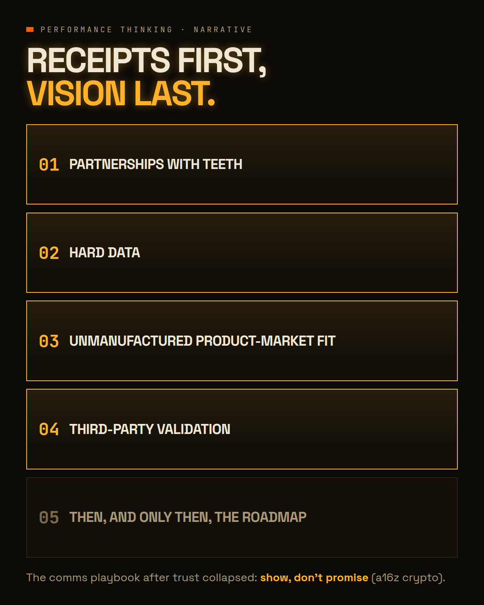
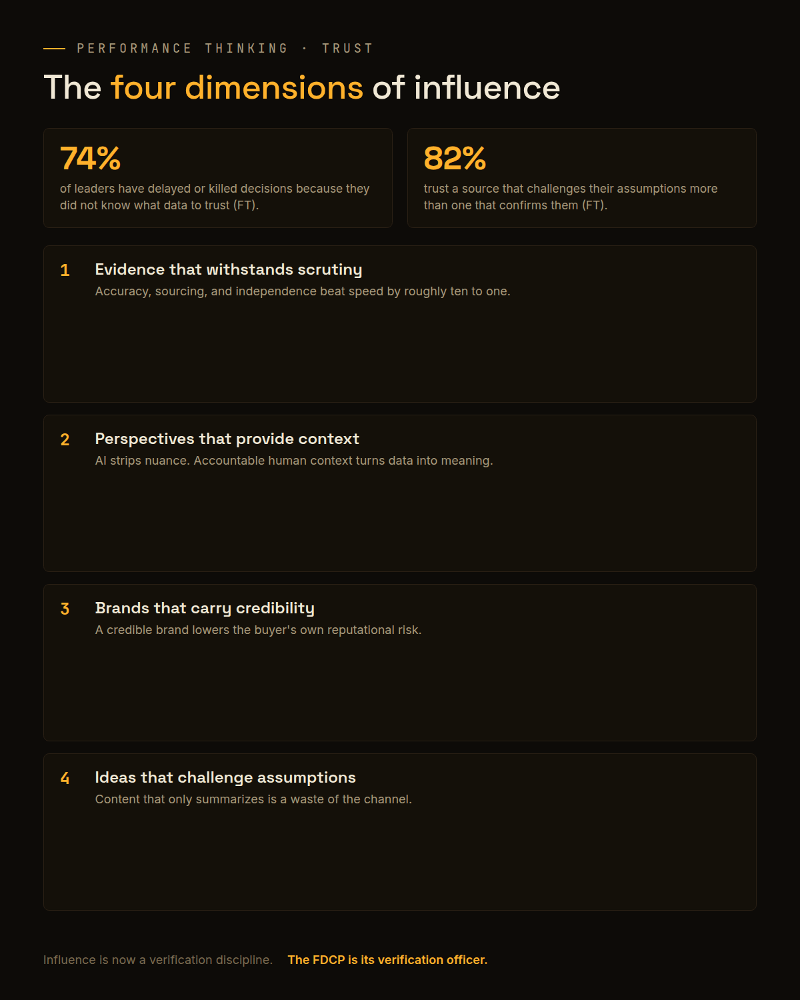
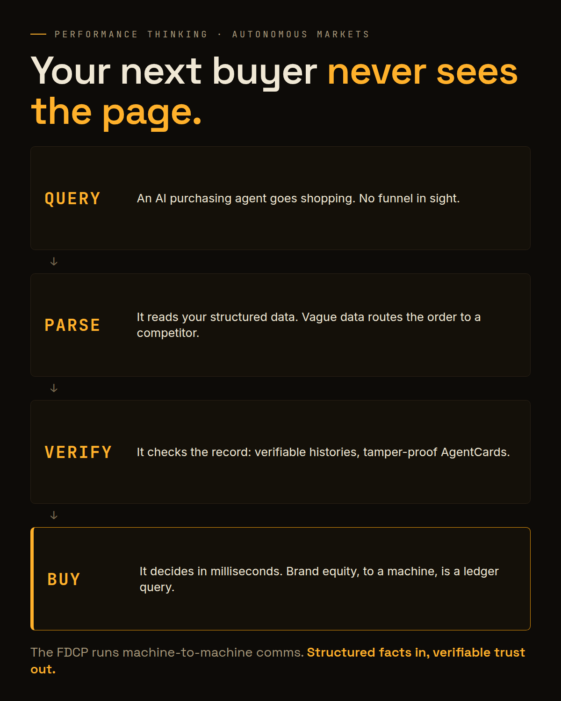

# The Forward-Deployed Communicator
### Performance Thinking · On the operator the autonomous market demands

**Attribution note:** Written and published by False Dawn Industries. This report synthesizes public research and talks from AWS Events, the Financial Times, Gartner (as reported by Ramp), Anthropic's Fiona Fung, LangChain, Addy Osmani, a16z crypto, Profound, Brandpipers, CodiLime, and Zhao et al. (arXiv:2507.19550). All sources are credited inline. Nothing here is legal or financial advice.

---

The job title that matters most in marketing over the next decade does not exist on most org charts yet. We call it the Forward-Deployed Communications Professional, the FDCP, and this report is the full argument for why you should hire, train, and organize around it now.

Here is the compressed version. Agentic AI turned software from a tool you operate into a participant that acts. The marginal cost of producing content collapsed toward zero, so the old constraint on marketing, the cost and speed of human execution, is gone. What replaced it is a new set of bottlenecks: verification, strategic alignment, security, and human taste. The assembly-line MarCom department, with its handoffs from strategist to copywriter to designer to media buyer, was built to optimize a constraint that no longer exists. It is overhead pretending to be process.

The market it was built for is disappearing too. Analysts tracking agentic commerce, including Gartner projections circulated by Ramp's work on [marketing to AI agents](https://ramp.com/blog), expect trillions of dollars of B2B purchasing to become agent-mediated within a few years. When a meaningful share of your buyers are autonomous programs that never see a landing page, a department organized entirely around persuading human eyeballs is structurally mispositioned.

*One FDCP, a fleet of agents on a governed platform, and ownership of the whole workflow instead of one slice of it.*

## Part 1: The person

### What a forward-deployed communicator actually is

The name borrows deliberately from engineering. Forward-deployed engineers sit inside the customer's problem and own the outcome end to end, pulling in whatever expertise the situation demands. The FDCP is the same posture applied to communications. They do not own a task. They own a workflow, from strategy through production through distribution through measurement, with AI agents filling in as on-demand domain experts wherever the FDCP has a gap.

An AWS Events talk on [team structures in an agentic world](https://aws.amazon.com/events/) describes this collapse of fragmented departments into what it calls hyperconvergence: execution teams distilled into a small number of highly capable generalists running agent fleets. The FDCP is what hyperconvergence looks like when it lands in MarCom.

Their real value is not generation. Any agent can generate. The FDCP is the bridge between two forces pulling in opposite directions: human skepticism, which is rising as synthetic content floods every channel, and machine discoverability, which now decides whether your brand exists at all in AI-mediated buying. One person, standing at the exact point where those two currents cross, with the authority to act on both.

### The four traits to hire for

When we filter candidates for this role, four traits matter more than any certification or channel specialty:

**A first-principles mindset.** The playbooks are expiring faster than they can be printed. The FDCP has to deconstruct a problem independent of legacy best practice, because much of that best practice was optimized for constraints AI already removed.

**System-level curiosity.** Multi-agent workflows fail in ways single tools never did. One change ripples through a pipeline of prompts, tools, and triggers. The FDCP instinctively pokes at how the pieces interact, not just whether one piece works.

**High-fidelity product taste.** Fiona Fung, a Director of Engineering at Anthropic, makes this point in her discussion of [running an AI-native engineering organization](https://claude.com/blog/running-an-ai-native-engineering-org): when the AI produces something technically correct but aesthetically dead, a human with taste is the only fix. Taste is the one input to the loop that cannot be automated, which makes it the most valuable input in the building.

**Collaborative orchestration.** The FDCP manages both human peers and autonomous agents, and treats the agent as a sub-agent that needs alignment, feedback, and review, not a vending machine that dispenses deliverables. Delegation skill now extends to non-human colleagues.

Certifications age in months. Operators with these four traits compound for decades.

### The Hourglass, or how not to eat your seed corn

The moment leadership realizes agents can do entry-level execution at a fraction of the cost, the spreadsheet suggests an obvious move: delete the entry level. The AWS framework calls the resulting shape the Diamond, a bulked-up middle managing the AI, a thin top, and no junior base. It feels efficient. It quietly destroys the mechanism by which senior judgment gets built, because expert judgment is not innate. It is manufactured by years of real execution, friction, and mistakes. Cut the base today and the enterprise faces a devastating shortage of senior talent by the early 2030s.

The shape that survives is the Hourglass, and it is where the FDCP lives:

- **A heavy top:** high-velocity FDCP pods executing with agent fleets.
- **A lean middle:** coordination handoffs disappear, so the management layer that existed to shepherd them shrinks.
- **A protected broad base:** juniors working in sandboxed environments whose mandate is not output. Their mandate is to build judgment, with high feedback frequency, so the top of the hourglass has a successor class.

Read correctly, the base is not a cost center held out of principle. It is an offensive position. Arm the junior layer with the same agent fleets the pods run and the economics invert: work that once priced out at senior rates ships from the base at junior cost, margin expands instead of shrinking, and the organization can take on more clients, more segments, and more markets without adding senior headcount. The Diamond cuts the base to protect this quarter's margin. The Hourglass upskills the base to grow next decade's surface area.

Holding a junior base on the balance sheet while competitors post record margins still takes conviction. That conviction is now a core competency of the modern CMO. We made the full org-design argument in our earlier report, The Hourglass Bet; this one is about the operator that shape exists to produce.

## Part 2: The process

### From prompting to Loop Engineering

Manual prompting is artisanal work. The leverage is in loops: automated, continuous workflows that build, verify, measure, and learn without a human initiating every cycle. The practice has been formalized on the engineering side by [LangChain](https://www.langchain.com/blog/the-art-of-loop-engineering) and by [Addy Osmani](https://addyosmani.com/blog/loop-engineering/), and the FDCP's toolkit is the MarCom translation of it. Three loops matter most:

**The verification loop is the gateway.** Before any generative loop touches an external channel, its output is scored against a strict rubric for brand voice, legal compliance, and factual accuracy. Fail means retry with feedback. Human sign-off stays hard-coded at the end for anything that ships, because the rubric catches errors and the human catches deadness.

**The SEO/GEO loop runs discovery.** An agent continuously audits your web properties, monitors how often AI systems cite your brand, and tests content structures to improve visibility, with an automated rollback trigger so an unverified structural change can never quietly damage your indexing.

**The performance ads iteration loop runs spend.** Agents generate creative variants across the ad platforms, watch return on ad spend, and adjust elements continuously until a campaign clears profitability, at a compute cost per run that is a rounding error next to a traditional agency retainer.

The FDCP does not sit inside these loops doing the work. They engineer the loops, set the rubrics, and reserve human attention for the two things loops cannot supply: strategy and taste.

### Pods on a platform

One pod running loops is a pilot. Scaling to many pods without chaos requires a specific operating structure: hyperconverged FDCP pods connected to a shared, centrally governed platform that handles runtime, memory, security, and observability for every pod at once. The pods stay small, fast, and autonomous. The platform stays boring, consistent, and safe. Each new pod, a growth pod, a narrative pod, a partnerships pod, inherits the guardrails on day one instead of reinventing them.

This is the operating model we build toward in MarCom OS, and it only works because of the layer underneath it.

### Policy as Code: the Riverbank

Continuous autonomous loops introduce real enterprise risk. An agent with a budget and API access can do damage at machine speed. The failed answer is ticket culture, where a human approves each action and the velocity advantage evaporates. The working answer is Policy as Code: brand guidelines, legal constraints, and budget limits translated from documents into executable rules that the infrastructure itself enforces, using engines such as [Open Policy Agent](https://codilime.com/blog/why-use-open-policy-agent-for-your-ai-agents/), a pattern HashiCorp has long described as [policy as code](https://www.hashicorp.com/en/blog/policy-as-code-explained).

We call this the Riverbank. The river is the fluid, fast, autonomous work of the agents. The riverbank is the immutable governance that gives the river its shape. Agents move freely inside it and cannot move outside it, and every action is intent-logged so a human can audit what happened and why. Written policy is a suggestion. Compiled policy is a wall. The FDCP operates the river; the Riverbank makes it safe to let them.

## Part 3: The market

### The Proof Stack: show, don't promise

While the FDCP's tooling gets more autonomous, their audience gets more skeptical. The Financial Times' study [New Dimensions of Influence](https://aboutus-test.ft.com/press_release/ft-new-dimensions-of-influence) found that 74 percent of business leaders have delayed or abandoned critical decisions because they did not know what data to trust, and 85 percent say AI-generated content makes credibility harder to assess. The historical playbook of selling a visionary narrative is dead. The ratio of vision to substance has inverted.

The a16z crypto comms team codified the replacement in [the new comms playbook: show, don't promise](https://a16zcrypto.substack.com/): sequence every external narrative around a Proof Stack of verifiable receipts, in strict order, before a single word of roadmap:

1. **Partnerships with teeth.** Deployed integrations a buyer can inspect, not memorandums of understanding.
2. **Hard data.** Active users, retention curves, and revenue that survive third-party verification.
3. **Unmanufactured product-market fit.** Organic community traction that visibly predates the PR push.
4. **Third-party validation.** Independent audits and coverage you did not buy.

*The FDCP re-sequences every narrative: receipts first, vision last, and vision only once the receipts have earned it.*

The FDCP's editorial job is subtraction: ruthlessly stripping visionary rhetoric that lacks empirical backing from every campaign, release, and landing page, then rebuilding the narrative in Proof Stack order.

### The Four Dimensions of Influence

The same FT research gives the FDCP a checklist for what earns executive attention once trust is this scarce. Every deliverable maps to four dimensions:

1. **Evidence that withstands scrutiny.** Leaders rank accuracy, clear sourcing, and independence far above speed; they are roughly ten times more likely to trust independently evidenced information than rapid, unverified claims. Being first with a flawed number is worse than being second with a bulletproof one.
2. **Perspectives that provide context.** AI organizes raw data and strips away human nuance in the same motion. Accountable human context, a named person translating data into meaning, is what decision-makers actually pay attention to.
3. **Brands that carry credibility.** In a sea of synthetic content, an established brand is a trust shortcut. Buyers align with credible brands to reduce their own internal reputational risk.
4. **Ideas that challenge assumptions.** 82 percent of leaders report trusting a source that pushes against their existing views more than one that confirms them. Content that merely summarizes existing knowledge is a waste of the organization's most expensive channel.

*74 percent of leaders have delayed decisions over data they could not trust. The four dimensions are the checklist for getting through.*

Notice what this list is not: reach, frequency, impressions. Influence at the executive level is now a verification discipline, and the FDCP is its verification officer.

### From SEO to GEO and LEO

Traditional search was a pull ecosystem: engines crawled, ranked ten blue links, and users came to your site. AI answer engines are a push ecosystem: models synthesize training data and retrieval-augmented grounding, then deliver a zero-click answer that may never send the buyer to you at all. The discipline that responds to this is Generative Engine Optimization, or LLM Engine Optimization, mapped in depth by [Profound's GEO framework](https://www.tryprofound.com/articles/generative-engine-optimization-geo-guide-2025).

The mechanics differ from SEO in every column that matters. Trust signals shift from backlinks and keywords to citation authority, entity depth, and brand mentions in reputable third-party sources. Intent shifts from keyword phrases to complex conversational prompts. The success metric shifts from rank and traffic to AI citation frequency and share of voice inside model outputs. And the competition is brutal in a specific way: models typically cite only a handful of domains per answer, so citation authority is close to a zero-sum game.

The FDCP's response is to treat the brand as an entity. Models understand the world through relationships between people, brands, and concepts, so the work becomes: absolute data consistency across the entire digital footprint, content restructured to directly answer conversational questions, and a deliberate campaign to earn mentions in the tier-one publications and authoritative sources that models weight heavily. This is where PR, SEO, and content stop being separate teams. In the pod, they are one loop.

### Marketing to machines: M2M and AgentCards

The furthest edge of the shift is the buyer that is not human at all. In agent-to-agent marketplaces, AI purchasing agents bypass visual interfaces entirely and read structured data, JSON-LD product facts, service-level terms, and pricing, straight from your servers. If your data is fragmented or vague, the agent does not ask a clarifying question. It routes the purchase to a competitor whose data parses cleanly.

Brand equity gets replaced by something harsher: empirical, verifiable reputation. Research on multi-agent economies by Zhao et al. ([arXiv:2507.19550](https://arxiv.org/abs/2507.19550)) describes AgentCards, tamper-proof smart contracts through which agents advertise capabilities, verify identities across organizational boundaries, and carry permanent transaction histories. Trust, for a machine buyer, is a ledger query.

*A machine buyer never sees your homepage. It sees your structured data, your terms, and your verifiable track record, and it decides in milliseconds.*

The FDCP operates the brand's machine-to-machine communications the way a previous generation operated its press office: publishing the structured facts agents parse, embedding specific, tracked incentives directly into the JSON-LD and service terms agents weigh, and maintaining the verifiable record agents trust. Machine legibility becomes a brand asset with a balance.

## What the FDCP is not

Three misreadings are worth killing early. The FDCP is not a prompt engineer with a better title. Prompting is a diminishing craft; the durable work is designing loops, rubrics, and guardrails, then judging what comes out of them. The FDCP is not a solo act that lets you fire the rest of the department. The role sits inside the Hourglass and depends on it: a governed platform under the pods, a protected junior base behind them, and a leadership layer willing to hold that structure while the spreadsheet argues otherwise. And the FDCP is not a technologist bolted onto marketing. The center of gravity is still communication: what to claim, what can be proven, and what a skeptical human or a literal-minded machine will do with the claim. The agents changed the tools. They did not change the accountability.

## The first 90 days

For a CMO who buys the argument, the transition compresses into three moves per month.

**Days 1 to 30: assess and contain.** Map your talent shape honestly: Pyramid, Diamond, or Hourglass. Freeze any hiring plan that grows the middle by cutting the base. Identify the two or three latent expert generalists already inside the team, the people with systems curiosity and taste hiding under specialist titles, and pull them out of legacy reporting lines as the first pod. With IT and security, stand up the Riverbank: a policy engine, compiled constraints, and intent logging before any agent touches an external channel. Cancel the 12-month roadmap theater and move to weekly just-in-time planning.

**Days 31 to 60: pilot loops and rebuild the narrative.** Build the verification loop first, trained on brand voice, legal, and factual-accuracy rubrics, with mandatory human final approval. Launch the SEO/GEO loop with automated rollback. In parallel, audit every pending campaign and landing page against the Proof Stack, and strip what cannot be backed.

**Days 61 to 90: scale pods and secure the base.** Formalize the pods-plus-platform structure and spin up the second and third pods on the shared governed platform. Cross-train SEO, PR, and content as one GEO discipline, and move the KPIs from traffic volume to citation frequency and entity depth. Launch the sandboxed junior program that protects the bottom of the Hourglass. And carve out maker time at the leadership level: the fastest way to kill managerial detachment is for the CMO to run a loop personally.

## The bottom line

The future of marketing is not producing more content faster. Content is free now, and everyone can smell it. The future is a small number of forward-deployed operators who orchestrate autonomous systems to win machine visibility, inside governance compiled into infrastructure, while applying scarce human judgment and taste to win human trust. The organizations that thrive will be the ones that restructure around that operator before the market forces them to.

So the question for your org chart is the same one we ask of every system we map: are you architected for the autonomous buyer, or are you still staffing the assembly line?

---

**Sources, credited by name:**
- AWS Events, "A leader's guide to advanced team structures in an agentic world" ([aws.amazon.com/events](https://aws.amazon.com/events/))
- Financial Times, "New Dimensions of Influence" ([press release](https://aboutus-test.ft.com/press_release/ft-new-dimensions-of-influence))
- Gartner projections on agentic commerce, as reported by Ramp ([ramp.com/blog](https://ramp.com/blog))
- Fiona Fung, Director of Engineering, Anthropic, "Running an AI-native engineering org" ([claude.com/blog](https://claude.com/blog/running-an-ai-native-engineering-org))
- LangChain, "The Art of Loop Engineering" ([langchain.com](https://www.langchain.com/blog/the-art-of-loop-engineering))
- Addy Osmani, "Loop Engineering" ([addyosmani.com](https://addyosmani.com/blog/loop-engineering/))
- a16z crypto, "The new comms playbook: show, don't promise" ([a16zcrypto.substack.com](https://a16zcrypto.substack.com/))
- Profound, "10-step framework for generative engine optimization" ([tryprofound.com](https://www.tryprofound.com/articles/generative-engine-optimization-geo-guide-2025))
- CodiLime, "Why Open Policy Agent is the missing guardrail for your AI agents" ([codilime.com](https://codilime.com/blog/why-use-open-policy-agent-for-your-ai-agents/))
- HashiCorp, "Policy as code, explained" ([hashicorp.com](https://www.hashicorp.com/en/blog/policy-as-code-explained))
- Zhao et al., "Towards Multi-Agent Economies" ([arXiv:2507.19550](https://arxiv.org/abs/2507.19550))

MCP, where referenced in FDI's products, is the Model Context Protocol, an open standard. False Dawn Industries is not affiliated with or endorsed by any company named above.
